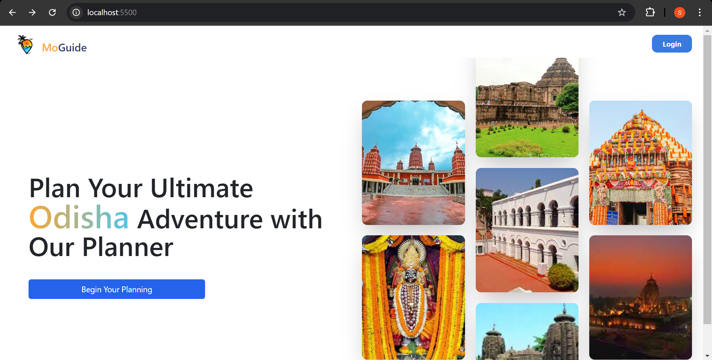
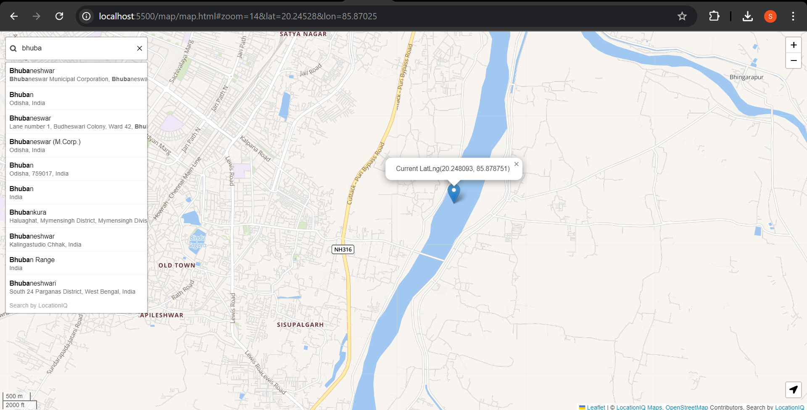

# MoGuide

Welcome to the Odisha Tourism Planner, a web application developed during the Code4Odisha hackathon. This project is designed to enhance tourism in Odisha, India, by providing an interactive planner that helps tourists explore both popular and lesser-known attractions across the state.

## Overview

The Odisha Tourism Planner is a user-friendly tool that allows tourists to create customized itineraries for their trips. Unlike other platforms, this planner goes beyond the well-known landmarks and highlights hidden gems—local stalls, restaurants, and lesser-visited places—offering an authentic experience of Odisha's rich culture and hospitality.

## Features

- **Interactive Planner**: Plan your trip by selecting from a variety of attractions and activities.
- **Customized Recommendations**: Discover off-the-beaten-path locations, including local eateries, stalls, and unique cultural spots.
- **Integrated Map**: Visualize your entire trip on a map, including routes and nearby points of interest. Visit [LocationIQ](https://my.locationiq.com/dashboard/) for map.
- **Authentication**: Uses google authentication to protect user data.

## Technologies Used

- **HTML**: Structure and content of the website.
- **Tailwind CSS**: Styling and layout of the website for a modern and responsive design.
- **JavaScript**: Interactivity and dynamic features of the planner and map.
- **Google Firebase**: Integrated Firebase Auth for secure, easy user authentication in the project.

## Screenshots

### 1. Landing Page


### 2. Planner Interface


### 3. Integrated Map


## How to Run the Project

1. Clone the repository:
   ```bash
   git clone https://github.com/yourusername/odisha-tourism-planner.git

2. Navigate to the project directory:
   ```bash
   cd odisha-tourism-planner

3. Open index.html in your web browser to view the project.

## Acknowledgements

This project was developed during the Code4Odisha Hackathon, an initiative to promote digital solutions for the state of Odisha.

## Meet the Team

- **Siddhartha Kumar** - [LinkedIn](https://www.linkedin.com/in/siddhartha-kumar-748751223/)
- **Shubhankar Shahi** - [LinkedIn](https://www.linkedin.com/in/shubhankar-shahi-20b588237/)
- **Biswa Bismay** - [LinkedIn](https://www.linkedin.com/in/biswabismay/)
- **Anisha Raj** - [LinkedIn](https://www.linkedin.com/in/anishaah/)
- **Yuvraj Singh** - [LinkedIn](https://www.linkedin.com/in/yuvraj229/)
```